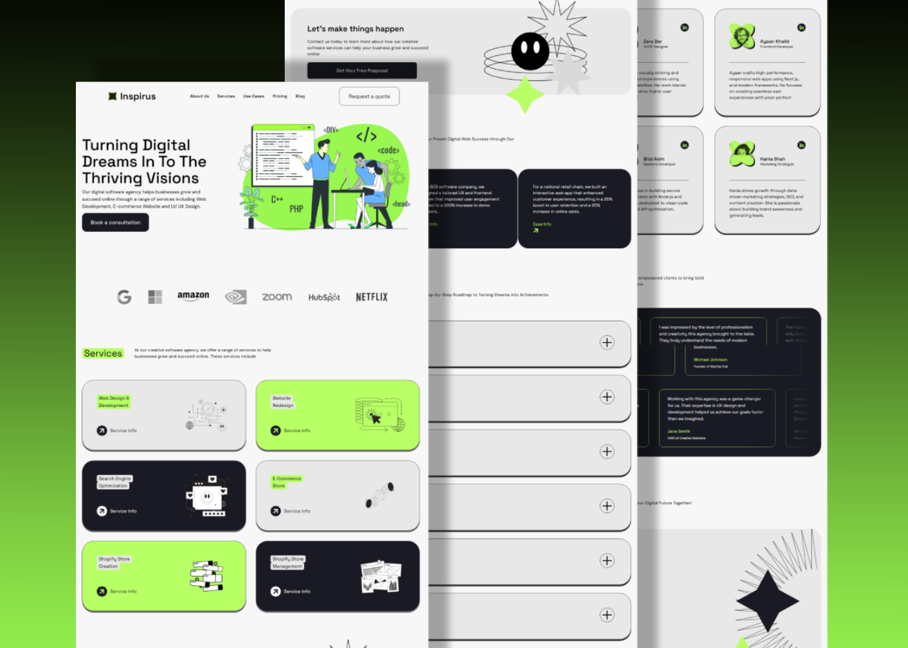

# Inspirus Agency

**Inspirus Agency** is a modern, responsive digital agency website built to showcase creative services and projects with smooth animations and an elegant user experience.

Live site: [https://inspirusagency.vercel.app](https://inspirusagency.vercel.app)

## Tech Stack

- **Next.js** – React framework for server-side rendering and routing
- **TypeScript** – Strongly typed JavaScript for better reliability
- **Tailwind CSS** – Utility-first CSS framework for rapid UI development
- **GSAP** – High-performance animations
- **Aceternity UI** – Sleek UI components for building modern interfaces

## Features

- Fully responsive design
- Smooth entrance and scroll animations (GSAP)
- Clean and modern layout
- Projects/portfolio showcase
- Services overview
- Contact/CTA section
- Built for speed and efficiency 

## Contributing

Contributions are welcome! Feel free to open issues or submit a pull request.

## License

This project is licensed under the MIT License.
